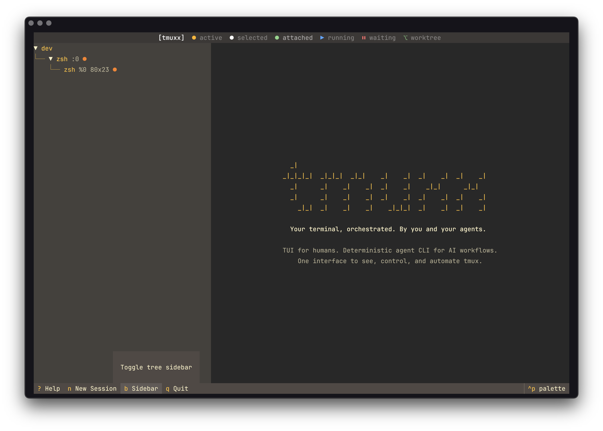

# tmuxx

Your terminal, orchestrated. By you and your agents.

```
  _|
_|_|_|_|  _|_|_|  _|_|    _|    _|  _|    _|  _|    _|
  _|      _|    _|    _|  _|    _|    _|_|      _|_|
  _|      _|    _|    _|  _|    _|  _|    _|  _|    _|
    _|_|  _|    _|    _|    _|_|_|  _|    _|  _|    _|
```

TUI for humans. Deterministic agent CLI for AI workflows. One interface to see, control, and automate tmux.



## Install

```bash
pip install tmuxx
# on Debian/Ubuntu or other externally-managed Python systems:
pipx install tmuxx
# optional Node wrapper (expects tmuxx binary in PATH):
npm install -g tmuxx
```

Requires Python 3.10+ and [tmux](https://github.com/tmux/tmux).
The npm package is a thin wrapper that forwards to the `tmuxx` binary.

On Debian/Ubuntu, plain `pip install tmuxx` may fail with an `externally-managed-environment` error (PEP 668). Use `pipx install tmuxx` instead, or install inside a virtual environment with `python3 -m venv .venv`.

> **Truecolor support:** If colors look off on your VM or remote server, enable truecolor:
> ```bash
> echo 'export COLORTERM=truecolor' >> ~/.bashrc
> ```

## Usage

```bash
# default: interactive TUI with pane activity indicators
tmuxx

# explicit TUI mode
tmuxx tui

# deterministic agent automation mode
tmuxx agent --help

# binary version
tmuxx --version
```

### TUI Features

The **interactive TUI** displays **pane-level activity status** with color-rendered preview:
- `▶` = **running** (blue) — agent actively processing
- `⏸` = **waiting** (red) — agent blocked on permission/input
- `⎇` = **worktree** (green) — 4th-level tree node showing git worktree branch

**Header legend** shows all status indicators at a glance. Preview panel renders full ANSI terminal colors.

The mission strip at the top shows the latest multi-agent mission: supervisor pane, worker counts, blocked/running/idle state, and missing worker targets. Press `m` to open the mission dashboard in the preview pane.

Worktree detection is automatic — any pane sitting in a git worktree shows `⎇ branch`. After attaching to a session, click `BACK` in the tmux status bar (top-left) to detach back to the TUI.

## Keybindings

| Key | Action |
|-----|--------|
| `n` | New session |
| `w` | New window |
| `h` | Split pane horizontally |
| `v` | Split pane vertically |
| `k` | Kill selected session/window/pane |
| `r` | Rename session or window |
| `s` | Activate selected window and focus selected/active pane |
| `a` | Attach to session |
| `c` | Send command to selected pane |
| `m` | Show mission dashboard |
| `/` | Filter sessions/windows by name |
| `y` | Yank (copy) preview to clipboard |
| `b` | Toggle sidebar |
| `?` | Show help menu |
| `R` | Force refresh |
| `+` / `-` | Resize pane up/down |
| `[` / `]` | Resize pane left/right |
| `q` | Quit |

## Agent Orchestration

Run parallel AI agents in isolated git worktrees, each with its own branch and tmux window. Monitor all agents with **pane-level activity visibility** — see which ones are running, idle, or blocked on user input.

### Deterministic Workflow Commands

```bash
tmuxx agent start-task <session_name> "<prompt>" [--branch ...] [--base-branch ...] [--agent-command ...]
tmuxx agent task-report <branch>
tmuxx agent complete-task <branch> [--test-command ...] [--commit-message ...]
tmuxx agent abort-task <branch>
tmuxx agent status
tmuxx agent watch [--event needs_prompt|running|idle|completed|attention|text] [--session ...]
tmuxx agent supervise --supervisor-pane <%id> [--worker-session ...] [--goal ...]
tmuxx agent mission start "<goal>" --supervisor-pane <%id> --worker dev:%1 --worker qa:%2
tmuxx agent mission status [mission_id]
tmuxx agent mission supervise [mission_id] --continuous
```

Recommended command flow for skills:

1. `start-task` creates worktree + tmux window and runs the agent command.
2. `task-report` provides branch status, diff, and log presence with stable fields.
3. `complete-task` or `abort-task` performs capture + cleanup in one operation.

If you omit `--agent-command`, tmuxx uses `TMUXX_AGENT_COMMAND` when set, otherwise it falls back to `claude -p` in a normal terminal. Inside an existing agent session, tmuxx refuses to guess a default and requires an explicit override. It also rejects same-family nested launches such as `codex ...` from Codex or `claude ...` from Claude when it can detect the active runtime. Activating from the TUI now always switches to the target window first, then focuses the selected pane (or that window's active pane).

### Watch or supervise workers

`watch` gives tmuxx a native hook-like primitive for machine-level automation. It polls tmux state until a condition matches, then returns JSON, optionally shows a desktop notification, and can execute a callback. `supervise` builds on the same signals, but instead of running an external callback it sends a structured handoff prompt into a supervisor pane.

```bash
# wake up when any pane in the Claude session needs user input
tmuxx agent watch --session claude --event needs_prompt --json

# wait until a task pane becomes attention-worthy (needs input or finishes)
tmuxx agent watch --branch feat-auth-tests --event attention --notify --json

# treat the current worker as already busy so attention can match its current prompt/idle state
tmuxx agent watch --pane %0 --event attention --assume-busy --json

# trigger on matched output text and run a callback with TMUXX_WATCH_* env vars
tmuxx agent watch --session claude --event text --pattern "Pushed" \
  --exec 'python3 watcher.py' --json

# send a supervision handoff to a supervisor pane
tmuxx agent supervise --supervisor-pane %9 --worker-session claude \
  --goal "finish the task" --json

# keep re-arming supervision for repeated worker interruptions
tmuxx agent supervise --supervisor-pane %9 --worker-branch feat-auth-tests \
  --continuous --max-handoffs 2 --json
```

### Mission harness

`mission` turns a group of existing tmux panes into an explicit agent collaboration harness. The supervisor pane represents the user; worker panes can be Claude, Codex, Copilot, Gemini, Droid, or any other CLI agent. tmux remains the raw workspace for agents, while tmuxx provides the human dashboard and JSON control plane.

```bash
# bind an existing Codex pane as dev and Claude pane as QA
tmuxx agent mission start "ship tmuxx 0.4.0" \
  --supervisor-pane %9 \
  --worker dev:%1 \
  --worker qa:%2 \
  --json

# inspect current mission state
tmuxx agent mission status --json

# wake the supervisor when workers block, finish, or go missing
tmuxx agent mission supervise --assume-busy --continuous --json
```

Worker bindings accept pane, window, session, or branch targets:
- `dev:%1`
- `qa:@2`
- `review:session:claude`
- `qa:branch:feat-auth-tests`

Mission state is stored in `.tmuxx/missions/<mission-id>.json` inside the current repository so other agents can inspect the same harness state.

Available watch events:
- `needs_prompt` — a pane is waiting for approval/input
- `running` — a pane is actively running
- `idle` — a pane is idle at the shell
- `completed` — watched panes were busy and then all became idle
- `attention` — watched panes were busy and then either need input or all become idle
- `text` — pane output matches `--pattern`

Use `--assume-busy` with `completed` or `attention` when you want tmuxx to treat the current pane state as post-busy immediately (useful for already-finished or already-blocked agent sessions).

When `--exec` is used, tmuxx exports these environment variables to the callback:
- `TMUXX_WATCH_EVENT`
- `TMUXX_WATCH_PAYLOAD`
- `TMUXX_WATCH_PANE_ID`
- `TMUXX_WATCH_WINDOW_ID`
- `TMUXX_WATCH_WINDOW_NAME`
- `TMUXX_WATCH_SESSION_ID`
- `TMUXX_WATCH_SESSION_NAME`
- `TMUXX_WATCH_BRANCH`

### JSON-first Mode

All `tmuxx agent` commands support `--json` for machine-safe parsing:

```bash
tmuxx agent list-worktrees --json
tmuxx agent start-task dev "fix login bug" --json
TMUXX_AGENT_COMMAND="gemini -p" tmuxx agent start-task dev "fix login bug" --json
tmuxx agent task-report fix-login-bug --json
tmuxx agent complete-task fix-login-bug --test-command "pytest -q" --json
tmuxx agent status --json
tmuxx agent watch --session claude --event needs_prompt --json
tmuxx agent supervise --supervisor-pane %9 --worker-session claude --json
```

### Configuration

Create `~/.config/tmuxx/config.json` (or `$XDG_CONFIG_HOME/tmuxx/config.json`):

```json
{
  "theme": "textual-dark",
  "refresh_interval": 2.0
}
```

`run-and-capture` is scoped to the command you send (it returns command-local output, not full pane scrollback).

### Full Command Surface

```bash
# introspection
tmuxx agent list-sessions
tmuxx agent capture-pane %1 --lines 200
tmuxx agent capture-window @2
tmuxx agent screenshot-window @2 --output ./window.png

# session/window/pane operations
tmuxx agent create-session dev
tmuxx agent create-window dev --name logs
tmuxx agent split-pane %3 --horizontal
tmuxx agent send-command %3 -- npm test
tmuxx agent send-text %3 -- "draft note in shell"
tmuxx agent send-keys %3 C-c
tmuxx agent send-keys %3 --literal -- "echo hello"
tmuxx agent run-and-capture %3 --wait-seconds 2 --lines 300 -- pytest -q

# worktree operations
tmuxx agent launch-agent dev "add auth tests" --base-branch feat-auth
tmuxx agent list-worktrees
tmuxx agent diff-worktree feat-auth-tests
tmuxx agent merge-worktree feat-auth-tests --test-command "pytest -q"
tmuxx agent discard-worktree feat-auth-tests
tmuxx agent read-agent-log feat-auth-tests

# watcher / notification primitives
tmuxx agent watch --session claude --event needs_prompt --notify
tmuxx agent watch --branch feat-auth-tests --event attention --json
tmuxx agent watch --pane %0 --event attention --assume-busy --json
tmuxx agent watch --session claude --event text --pattern "Pushed" --exec 'python3 watcher.py'
tmuxx agent supervise --supervisor-pane %9 --worker-session claude --goal "finish the task"
tmuxx agent supervise --supervisor-pane %9 --worker-branch feat-auth-tests --continuous --max-handoffs 2 --json
```

## Legacy MCP Compatibility (Optional)

`tmuxx` is now single-binary first. If you still need MCP for external clients, the legacy module remains in source.

```bash
pip install "tmuxx[mcp]"
python tmux_mcp.py
```

## License

MIT
